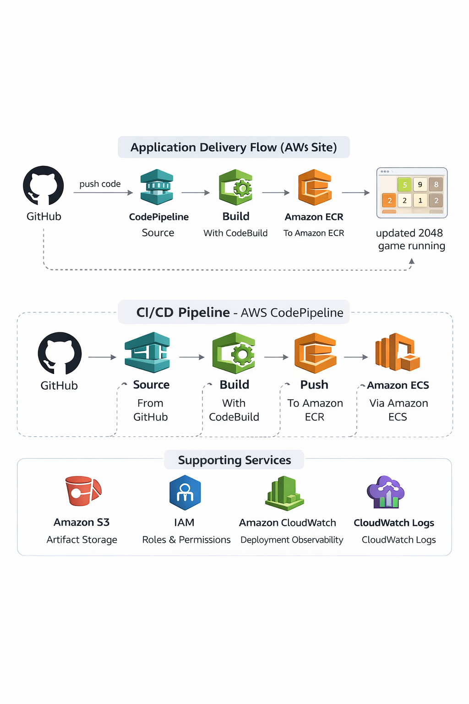

# 2048 Game CI/CD Pipeline on AWS

> A production-ready CI/CD pipeline for a containerized 2048 web application, automated from GitHub push to deployment on Amazon ECS using CodePipeline, CodeBuild, Amazon ECR, and Docker.


---

## Table of Contents

- [Problem Statement](#problem-statement)
- [Solution](#solution)
- [Architecture Overview](#architecture-overview)
- [Why These AWS Services](#why-these-aws-services)
- [CI/CD Pipeline](#cicd-pipeline)
- [Application Features](#application-features)
- [Project Structure](#project-structure)
- [Dockerfile](#dockerfile)
- [Buildspec](#buildspec)
- [Running Locally](#running-locally)
- [Deploying to AWS](#deploying-to-aws)
- [Challenges and Lessons Learned](#challenges-and-lessons-learned)
- [Screenshots](#screenshots)
- [Future Improvements](#future-improvements)

---

## Problem Statement

A simple web application can be deceptively painful to deploy when the process is manual. Even if the app itself is static, the release flow still involves multiple operational steps: build the Docker image, tag it correctly, push it to a registry, update the runtime environment, and verify that the new version is actually the one being served. That may be manageable for a one-off demo, but it breaks down quickly once changes start happening regularly.

To put that into perspective, a single release for this application involved at least 7 meaningful actions:

1. pull or update the source code  
2. build the Docker image  
3. tag the image correctly  
4. authenticate to the container registry  
5. push the image  
6. update the ECS runtime  
7. verify the deployment worked  

If a team made only 2 updates per week, that would already mean roughly **56 manual deployment actions per month**. Every repeated action becomes another opportunity for error: wrong image tag, wrong repository, wrong task definition revision, wrong container name, missing artifact, or a runtime mismatch that only appears after deployment.

This project uses the 2048 game as a lightweight frontend application, but the real challenge being solved is **deployment reliability**. The goal was to remove manual release friction and create a repeatable cloud-native workflow where code moves from GitHub to production through a controlled CI/CD pipeline.

The result is not just “a game hosted on AWS.” It is a practical DevOps delivery pipeline that automates packaging, registry publishing, artifact generation, and container deployment on Amazon ECS.

---

## Solution

This project delivers two things simultaneously:

**1. A containerized frontend application**  
The original 2048 game is packaged into a Docker image and served with Nginx as a lightweight web application.

**2. An end-to-end AWS CI/CD pipeline**  
Every push to GitHub triggers a pipeline that builds the Docker image, pushes it to Amazon ECR, generates `imagedefinitions.json`, and deploys the updated image to an Amazon ECS service using rolling deployment.

This replaces a fragile manual deployment flow with a repeatable release process.

---

## Architecture Overview

```text
APPLICATION DELIVERY FLOW
─────────────────────────────────────────────────────────────
Developer
   |
   |  git push
   v
GitHub Repository
   |
   v
AWS CodePipeline
   |
   |  Source stage pulls latest code
   v
AWS CodeBuild
   |
   |  Docker build
   |  Docker push
   |  Generate imagedefinitions.json
   v
Amazon ECR
   |
   |  Updated image stored in registry
   v
AWS CodePipeline Deploy Stage
   |
   |  Passes build artifact to ECS
   v
Amazon ECS Service
   |
   |  Rolling deployment
   v
Updated 2048 Game Running
```

### Architecture Diagram



### Release Flow Summary

1. Developer pushes code to GitHub  
2. CodePipeline detects the change  
3. CodeBuild builds a new Docker image from that code  
4. CodeBuild pushes the image to Amazon ECR  
5. CodeBuild creates `imagedefinitions.json`  
6. CodePipeline passes that artifact to the ECS deploy stage  
7. ECS rolls out the new image  

---

## Why These AWS Services

### GitHub — Source Control and Trigger

**The problem it solves:** code changes need a clear source of truth and a reliable event to trigger automation.

**Why GitHub specifically:**
- stores the application source and deployment configuration together
- provides clean version history for every change
- acts as the natural trigger point for CI/CD
- makes the project easy to demonstrate publicly in a portfolio

---

### AWS CodePipeline — CI/CD Orchestration

**The problem it solves:** manual deployment steps are inconsistent and difficult to repeat safely.

**Why CodePipeline specifically:**
- coordinates the source, build, and deploy stages in one managed workflow
- provides a visual view of the release lifecycle
- makes it easier to trace where failures occur
- integrates natively with CodeBuild and ECS

**Why not manual deployment:** because manual release steps do not scale well and are too easy to get wrong under repeated change.

---

### AWS CodeBuild — Build and Packaging Engine

**The problem it solves:** ECS does not deploy raw source code from GitHub. It needs a container image and a deployment artifact.

**Why CodeBuild specifically:**
- builds the Docker image directly from the GitHub source
- pushes the image to Amazon ECR
- generates `imagedefinitions.json` for the ECS deploy action
- provides logs that are very useful during troubleshooting

CodeBuild is the bridge between source code and a deployable runtime artifact.

---

### Amazon ECR — Image Registry

**The problem it solves:** the pipeline needs a centralized place to store the built container image.

**Why ECR specifically:**
- integrates natively with both CodeBuild and ECS
- stores versioned images in the same AWS environment
- removes the need for an external registry
- keeps the deployment flow cloud-native and straightforward

---

### Amazon ECS — Container Runtime

**The problem it solves:** after the image is built, the application still needs a managed place to run.

**Why ECS specifically:**
- runs the application as a managed container service
- supports rolling deployment updates
- integrates cleanly with ECR and CodePipeline
- avoids the additional operational overhead of Kubernetes for a project of this size

**Why not Kubernetes:** for this use case, ECS is simpler and still demonstrates real-world container deployment principles.

---

### Docker — Consistent Application Packaging

**The problem it solves:** the app needs to run the same way in different environments.

**Why Docker specifically:**
- packages the app into a portable deployment unit
- keeps the runtime consistent from build to deployment
- works naturally with ECR and ECS
- makes the application easier to reproduce and troubleshoot

---

## CI/CD Pipeline

This pipeline uses three main stages:

### Stage 1 — Source

A push to GitHub triggers CodePipeline automatically.

### Stage 2 — Build

CodeBuild:
- authenticates to Amazon ECR
- builds the Docker image
- pushes the image to ECR
- generates `imagedefinitions.json`

### Stage 3 — Deploy

CodePipeline passes the build artifact to the ECS deploy action, and ECS rolls out the new image to the running service.

---

## Application Features

- browser-based 2048 gameplay
- static frontend delivery through Nginx
- Dockerized packaging for consistent deployment
- automated GitHub-to-ECS deployment workflow
- rolling deployment updates through ECS
- registry-backed image version flow using Amazon ECR

---

## Project Structure

```text
2048-game-containerized-pipeline-on-aws/
├── buildspec.yml
├── Dockerfile
├── index.html
├── js/
│   ├── animframe_polyfill.js
│   ├── application.js
│   ├── bind_polyfill.js
│   ├── classlist_polyfill.js
│   ├── game_manager.js
│   ├── grid.js
│   ├── html_actuator.js
│   ├── keyboard_input_manager.js
│   ├── local_storage_manager.js
│   └── tile.js
├── meta/
│   ├── apple-touch-icon.png
│   ├── apple-touch-startup-image-640x1096.png
│   └── apple-touch-startup-image-640x920.png
├── style/
│   ├── helpers.scss
│   ├── main.css
│   └── main.scss
├── images/
│   ├── architecture.png
│   ├── codepipeline-success.png
│   ├── codebuild-success.png
│   ├── ecs-service.png
│   └── game-ui.png
└── README.md
```

---

## Dockerfile

```dockerfile
FROM nginx:alpine

COPY . /usr/share/nginx/html

EXPOSE 80

CMD ["nginx", "-g", "daemon off;"]
```

This works well because the 2048 game is a static frontend application and Nginx is enough to serve the assets efficiently.

---

## Buildspec

```yaml
version: 0.2

phases:
  pre_build:
    commands:
      - echo Logging in to Amazon ECR...
      - aws ecr get-login-password --region us-east-1 | docker login --username AWS --password-stdin 247606490890.dkr.ecr.us-east-1.amazonaws.com
      - echo "Build environment architecture:"
      - uname -m
      - docker version
      - docker buildx create --use --name mybuilder || docker buildx use mybuilder

  build:
    commands:
      - echo Building and pushing linux/amd64 image...
      - docker buildx build --platform linux/amd64 -t 247606490890.dkr.ecr.us-east-1.amazonaws.com/2048-gamerepo:latest --push .

  post_build:
    commands:
      - echo Creating imagedefinitions.json file for ECS deployment...
      - printf '[{"name":"2048-container","imageUri":"%s"}]' 247606490890.dkr.ecr.us-east-1.amazonaws.com/2048-gamerepo:latest > imagedefinitions.json
      - cat imagedefinitions.json

artifacts:
  files:
    - imagedefinitions.json
```

---

## Running Locally

```bash
git clone https://github.com/njamutoh/2048-game-containerized-pipeline-on-aws.git
cd 2048-game-containerized-pipeline-on-aws

docker build -t 2048-gamerepo .
docker run -d -p 8080:80 --name 2048-game 2048-gamerepo
```

Visit:

```text
http://localhost:8080
```

---

## Deploying to AWS

### High-Level Steps

1. Create an Amazon ECR repository  
2. Create an ECS cluster, task definition, and service  
3. Create a CodeBuild project  
4. Create a CodePipeline pipeline with Source, Build, and Deploy stages  
5. Push changes to GitHub and let the pipeline deploy the application automatically  

### ECS Deployment Notes

- the ECS task definition container name must match the `name` field in `imagedefinitions.json`
- the ECS service must be attached to the correct task definition revision
- the image architecture must match the ECS runtime architecture

---

## Challenges and Lessons Learned

This project became much stronger because it was not just a straight-line setup. I ran into multiple real issues across source control, CodeBuild, ECR, ECS, and runtime behavior. Solving them gave me a much deeper understanding of how the AWS deployment flow works in practice.

### 1. Source Repository and Fork Confusion

One of the first issues was around the source itself. I had forked the original repository and expected the pipeline to use my updated fork, but the build behavior suggested the process was not always referencing the version I thought it was. That created confusion around whether the problem was in my code, my `buildspec.yml`, or the source configuration.

That forced me to separate two ideas:
- where the code lived
- what source artifact was actually reaching CodeBuild

This was an important lesson because in CI/CD, it is easy to assume the pipeline is using the correct branch or repository when the real problem is that the wrong source is being built.

### 2. Build Failure Because the Dockerfile Was Missing

A major early blocker happened during the build stage. CodeBuild kept failing at the image build step, and the logs showed:

```text
Error while executing command: docker build -t 2048-gamerepo . Reason: exit status 1
```

After adding debug commands, the logs made the underlying problem more obvious:

```text
cat: Dockerfile: No such file or directory
Error response from daemon: No such image: 2048-gamerepo:latest
no matching artifact paths found
```

At first, that looked like it could be an ECR issue or Docker daemon issue, but the real problem was much simpler: the `Dockerfile` was not present in the source artifact CodeBuild was actually using. Once that was corrected, the build stage moved forward.

### 3. ECS Deploy Failure Due to Container Name Mismatch

After the image build issues were fixed, the deploy stage still failed. The specific error was:

```text
Invalid action configuration
The AWS ECS container 2048-container does not exist
```

That turned out to be a mapping issue between `imagedefinitions.json` and the ECS task definition. The `name` field inside the artifact had to match the exact container name defined in the active ECS task definition revision.

To solve it, I had to inspect the task definition, verify the real container name, create a new revision where necessary, and then update the ECS service to use the correct revision. This was a useful reminder that successful deployment depends not just on the image, but also on the exact container definition metadata.

### 4. Runtime Failure: Exec Format Error

The final issue was the most interesting because the pipeline itself was already much closer to working. The deployment reached ECS, but then the container failed to start with this error:

```text
exec /docker-entrypoint.sh: exec format error
```

In simple terms, the image that was built and pushed did not align with the runtime architecture expected by the ECS task definition. I simplified the solution by forcing the image build process to explicitly target `linux/amd64`, which matched the `X86_64` runtime used by ECS.

That resolved the startup problem and reinforced an important lesson: even when the pipeline stages are correct, runtime compatibility still matters.

### 5. IAM Permission and Service Role Troubleshooting

Another practical issue involved permissions across the AWS services in the pipeline. Even when the pipeline logic is correct, CodeBuild and CodePipeline still need the right IAM permissions to interact with ECR, ECS, S3, CloudWatch Logs, and each other. If those roles are missing required access, the failure can look like a build issue, deploy issue, or artifact issue when the root cause is actually IAM.

This project reinforced how important it is to verify:
- the CodeBuild role can push images to ECR and write logs
- the pipeline role can read artifacts and trigger the ECS deploy action
- the ECS task execution role can pull the image from ECR

That was an important DevOps reminder that successful automation depends not just on code and configuration, but also on the permissions model connecting the services.

---

## Screenshots

### Architecture


### CodePipeline Success


### CodeBuild Success


### ECS Service


### Running Application


---

## Future Improvements

- place the service behind an Application Load Balancer
- add HTTPS and custom domain routing
- improve image versioning beyond `latest`
- add automated testing before deployment
- provision infrastructure with Terraform
- tighten IAM permissions using least privilege
- add CloudWatch dashboards and alarms
- separate dev and prod environments

---
